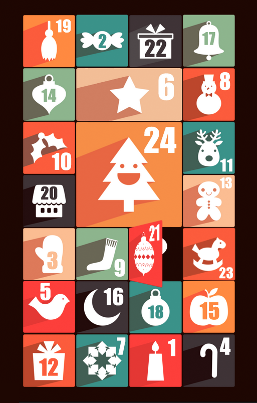

# PHP & CSS3 Advent Calendar

[](https://scrutinizer-ci.com/g/M-arcus/css3adventcalendar/?branch=master) 

This is a small project that aims to help creating HTML-based advent calendars. It uses CSS3 transitions to create a 3D door opening effect.

## Example



[The images used in the example calendar belong to Pelfusion. See their license statement for more details.](http://pelfusion.com/35-new-free-long-shadow-christmas-icons/)

## Configuration

Set width and height for the calendar:

```json
...
"config": {
    "calendarWidth": "500",
    "calendarHeight": "840"
  },
...
```

Add entries for the days
```json
...
"entries": [
    {
      "unlockDate": "2013-12-19",
      "doorWidth": "118",
      "doorHeight": "118",
      "positionTop": "0",
      "positionLeft": "0",
      "doorImageLeft": "images/19.png",
      "backgroundImage": "images/background1x1.png",
      "url": "#"
    },
    ...
]
...
```

## Browser support

Unfortunately, older versions of Internet Explorer do not support CSS3 that well. The example calendar uses a fallback where the calendar doors are just hidden on hover.

